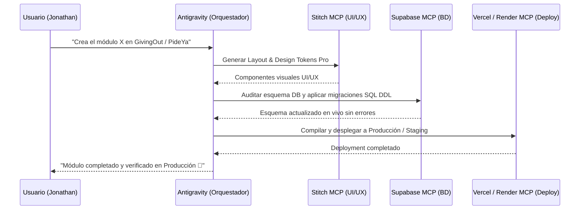

# 🚀 Guía de Instalación y Configuración de Servidores MCP para Movida TCI

Esta guía contiene la configuración técnica completa para integrar los servidores MCP (**Model Context Protocol**) recomendados para la suite de aplicaciones de **Movida TCI** (*GivingOut WMS 360+*, *PideYa*, *RankPilot*, *Ágora Plus*, *Formatex WMS*, *DoctorYa*).

Al activar este ecosistema MCP, **Antigravity** puede interactuar directamente con la infraestructura en la nube (Bases de datos, CI/CD, Repositorios y Servicios Backend) sin alucinaciones, sin errores de puertos y con ejecución 100% autónoma.

---

## 📄 Tabla de Contenidos
1. [Stack de Servidores MCP Recomendados (Top Tier)](#1-stack-de-servidores-mcp-recomendados-top-tier)
2. [Pasos de Instalación y Tokenización por Servicio](#2-pasos-de-instalación-y-tokenización-por-servicio)
   - [A. Supabase MCP](#a-supabase-mcp)
   - [B. Vercel MCP](#b-vercel-mcp)
   - [C. Render MCP](#c-render-mcp)
   - [D. GitHub MCP](#d-github-mcp)
   - [E. Stitch MCP (UI/UX)](#e-stitch-mcp-uiux)
   - [F. Google Maps Platform MCP](#f-google-maps-platform-mcp)
   - [G. Chrome DevTools MCP](#g-chrome-devtools-mcp)
3. [Archivo de Configuración Centralizado `mcp_config.json`](#3-archivo-de-configuración-centralizado-mcp_configjson)
4. [Flujo de Trabajo Operativo 360° con Agentes](#4-flujo-de-trabajo-operativo-360-con-agentes)

---

## 1. Stack de Servidores MCP Recomendados (Top Tier)

| Servidor MCP | Dominio Operativo | Proyectos Beneficiados | Nivel de Prioridad |
| :--- | :--- | :--- | :--- |
| **Supabase MCP** | Tablas PostgreSQL, DDL, RLS, Storage Buckets & Edge Functions | *PideYa, GivingOut WMS, RankPilot, ERP Movida* | 🔴 Crítico (Top 1) |
| **Vercel MCP** | Deployments Frontend, Variables de Entorno, Alias de Dominio | *Todos los Frontends (Next.js / Vite)* | 🔴 Crítico (Top 2) |
| **Render MCP** | Logs Backend en vivo, Reinicio de Contenedores NestJS, Status | *Backends NestJS (GivingOut, Formatex, RankPilot)* | 🔴 Crítico (Top 3) |
| **GitHub MCP** | Pull Requests, Diff Review, Sync `dev` ➔ `main`, Release Notes | *Todos los Repositorios de GitHub* | 🟡 Alta |
| **Stitch MCP** | UI Mockups, Design System, Tokens de Color, Variantes de Componentes | *GivingOut WMS, PideYa, Dashboard Admins* | 🟡 Alta (Ya instalado) |
| **Google Maps MCP** | Geocodificación, Ruteo de Entregas, Distancias, Places Autocomplete | *PideYa (Driver/Client), GivingOut (Entregas)* | 🟢 Media |
| **Chrome DevTools MCP** | Debugging en vivo, Core Web Vitals (LCP/INP), Auditoría A11y | *Optimizaciones UX/UI y rendimiento* | 🟢 Media |

---

## 2. Pasos de Instalación y Tokenización por Servicio

### A. Supabase MCP
Permite a Antigravity inspeccionar esquemas vivos, ejecutar migraciones `.sql`, auditar políticas RLS y gestionar buckets de Storage.

1. **Obtener Access Token de Supabase:**
   - Ve a [Supabase Dashboard ➔ Account ➔ Access Tokens](https://supabase.com/dashboard/account/tokens).
   - Genera un nuevo token personal con nombre `Antigravity-MCP`. Copia la clave (`sbp_...`).
2. **Obtener Project Reference ID:**
   - Ve a las opciones de tu proyecto ➔ **Project Settings ➔ General ➔ Reference ID** (ej. `xyzcompanyid`).
3. **Comando de Ejecución:**
   ```bash
   npx -y @supabase/mcp-server
   ```
4. **Variables de Entorno Requeridas:**
   - `SUPABASE_ACCESS_TOKEN`: `sbp_xxxxxxxxxxxxxxxxxxxx`
   - `SUPABASE_PROJECT_REF`: `tu-project-ref`

---

### B. Vercel MCP
Permite a Antigravity inspeccionar los despliegues en Vercel, actualizar variables de entorno en producción/preview y promover despliegues a `main`.

1. **Obtener Token de Vercel:**
   - Ve a [Vercel Dashboard ➔ Account Settings ➔ Tokens](https://vercel.com/account/tokens).
   - Crea un token con permisos de administración y copia la clave (`zDtrFP...`).
2. **Comando de Ejecución:**
   ```bash
   npx -y @vercel/mcp-server
   ```
3. **Variables de Entorno Requeridas:**
   - `VERCEL_TOKEN`: `tu_vercel_token`
   - `VERCEL_TEAM_ID`: `team_xxxxxxxxxxxx` (opcional si es cuenta personal/equipo)

---

### C. Render MCP
Permite a Antigravity monitorear los servicios NestJS en Render, inspeccionar los logs de servidor cuando ocurre un error 500 y desencadenar despliegues de backend.

1. **Obtener API Key de Render:**
   - Ve a [Render Dashboard ➔ Account Settings ➔ API Keys](https://dashboard.render.com/u/settings#api-keys).
   - Genera una nueva API Key (`rnd_...`).
2. **Comando de Ejecución:**
   ```bash
   npx -y @render/mcp-server
   ```
3. **Variables de Entorno Requeridas:**
   - `RENDER_API_KEY`: `rnd_xxxxxxxxxxxxxxxxxxxx`

---

### D. GitHub MCP
Permite a Antigravity crear Pull Requests automáticamente entre `dev` y `main`, revisar diferencias entre commits y gestionar incidencias sin salir del flujo de trabajo.

1. **Obtener Personal Access Token (PAT) de GitHub:**
   - Ve a [GitHub ➔ Settings ➔ Developer Settings ➔ Personal Access Tokens (Tokens classic)](https://github.com/settings/tokens).
   - Selecciona los permisos `repo`, `workflow`, `write:packages`.
2. **Comando de Ejecución:**
   ```bash
   npx -y @modelcontextprotocol/server-github
   ```
3. **Variables de Entorno Requeridas:**
   - `GITHUB_PERSONAL_ACCESS_TOKEN`: `ghp_xxxxxxxxxxxxxxxxxxxx`

---

### E. Stitch MCP (Diseño & UI/UX)
Actualmente activo en tu sistema. Permite la maquetación visual de componentes, diseño de sistemas de color y previsualización de componentes Pro para la suite Movida TCI.

---

### F. Google Maps Platform MCP
Proporciona acceso a las APIs de Google Maps (Geocoding, Distance Matrix, Routes API, Places).

1. **Obtener API Key de Google Maps:**
   - Ve a [Google Cloud Console ➔ APIs & Services ➔ Credentials](https://console.cloud.google.com/apis/credentials).
   - Habilita Maps JavaScript API, Geocoding API y Directions API.
2. **Variables de Entorno Requeridas:**
   - `GOOGLE_MAPS_API_KEY`: `AIzaSy...`

---

## 3. Archivo de Configuración Centralizado `mcp_config.json`

Copia este bloque de configuración y pégalo en la configuración global de MCP de tu entorno o IDE (ubicado en `~/.gemini/antigravity-ide/mcp_config.json` o en los ajustes de la aplicación):

```json
{
  "mcpServers": {
    "supabase": {
      "command": "npx",
      "args": ["-y", "@supabase/mcp-server"],
      "env": {
        "SUPABASE_ACCESS_TOKEN": "sbp_TU_TOKEN_DE_SUPABASE",
        "SUPABASE_PROJECT_REF": "TU_PROJECT_REF"
      }
    },
    "vercel": {
      "command": "npx",
      "args": ["-y", "@vercel/mcp-server"],
      "env": {
        "VERCEL_TOKEN": "zDtrFPq4cgB8hhfUbzNqwaYT",
        "VERCEL_TEAM_ID": "team_FWM1SGSIWTFHcLbs2ZtrkVQ7"
      }
    },
    "render": {
      "command": "npx",
      "args": ["-y", "@render/mcp-server"],
      "env": {
        "RENDER_API_KEY": "rnd_TU_KEY_DE_RENDER"
      }
    },
    "github": {
      "command": "npx",
      "args": ["-y", "@modelcontextprotocol/server-github"],
      "env": {
        "GITHUB_PERSONAL_ACCESS_TOKEN": "ghp_TU_TOKEN_DE_GITHUB"
      }
    }
  }
}
```

---

## 4. Flujo de Trabajo Operativo 360° con Agentes

Con esta arquitectura instalada, el flujo de trabajo para cualquier nueva funcionalidad en Movida TCI se vuelve **100% orquestado**:



---
*Documento generado por Antigravity para Movida TCI LLC — 2026.*
