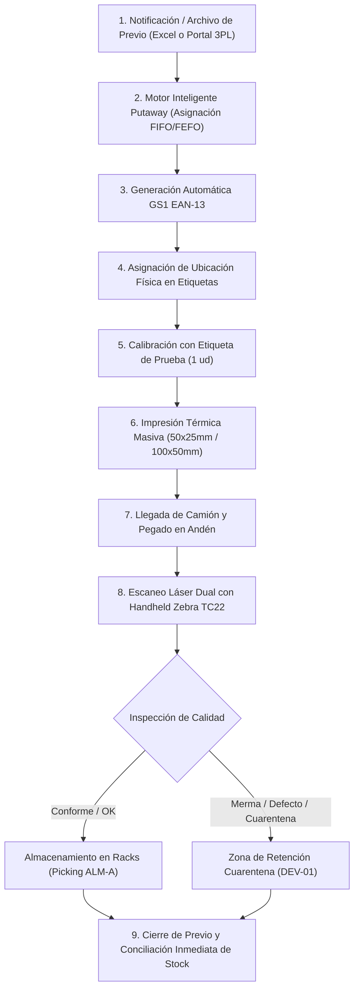

# 📦 Giving Out WMS 360+ — Flujo Operativo del Módulo de Recepción

> **Documento Oficial de Procesos Operativos y Logística 3PL**  
> **Sistema:** Giving Out WMS 360+ (Operador Logístico 3PL)  
> **Versión:** 1.2.2  
> **Fecha de Actualización:** Agosto 2026  
> **Audiencia:** Dueños de Negocio (Product Owners), Gerencia de Operaciones, Supervisores de CEDIS y Almacenistas.

---

## 📑 1. Resumen Ejecutivo

El **Módulo de Recepción de Giving Out WMS** ha sido diseñado bajo los más altos estándares de la industria logística 3PL y retail/textil, eliminando los cuellos de botella clásicos de la descarga en andén, previniendo errores humanos de digitación, protegiendo insumos costosos de impresión térmica y optimizando la capacidad cúbica del almacén desde el primer minuto.

---

## 🔄 2. Fases Detalladas del Proceso Operativo

---

### 📥 FASE 1: Ingesta del Previo de Recibo (ASN / Pre-Alert)
* **Objetivo:** Registrar con anticipación la mercancía que arribará al centro de distribución para planificar andenes, insumos y espacio físico en racks.
* **Canales de Entrada:**
  1. **Carga Masiva Excel:** Carga directa del archivo de previo provisto por el proveedor o depositante (reconocimiento automático de columnas: `factura`, `Ean`, `Cantidad a recibir`, `Talla`, `Color`, `Descripción`).
  2. **Portal de Depositantes:** Los clientes externos cargan sus solicitudes de ingreso de forma autónoma.
* **Auto-creación en Catálogo Maestro:** Si un producto/SKU es nuevo, el WMS lo da de alta automáticamente en `SkuMaster` para evitar bloqueos operativos.

---

### 🧠 FASE 2: Motor Inteligente de Ubicaciones (Smart Putaway)
* **Objetivo:** Eliminar la improvisación en el guardado de mercancía, asignando automáticamente la ubicación óptima según el tipo de producto.
* **Variables Evaluadas por el Algoritmo:**
  * **Zonificación por Rubro:** Mercancía textil/ropa se canaliza a pasillos de prendas (`ALM-A`); alimentos o no perecederos a zonas correspondientes.
  * **Rotación FIFO (First-In, First-Out):** Asignación preferente en **Nivel 1 (piso/picking rápido)** para facilitar el posterior surtido de pedidos.
  * **Cálculo de Ocupación en Tiempo Real:** El sistema verifica que la ubicación tenga capacidad disponible (`🟢 100% Libre` o espacio remanente).
* **Flexibilidad Operativa:** El supervisor puede aceptar la sugerencia del sistema (`⭐ Sugerida por IA/Layout`) o cambiarla con el selector con buscador en vivo si requiere reubicar la carga.

---

### ⚡ FASE 3: Generación de Códigos GS1 EAN-13
* **Objetivo:** Estandarizar la identificación de todos los productos para permitir trazabilidad digital mediante escaneo láser.
* **Funcionalidad:**
  * Para mercancías que lleguen sin código de barras de fábrica, el WMS genera códigos de estándar internacional **GS1 México (prefijo `750` + dígito verificador calculado)**.
  * Actualización instantánea en la base de datos y en la visualización del previo.

---

### 🏷️ FASE 4: Impresión Térmica con Ubicación Destino y Protección de Insumos
* **Objetivo:** Imprimir las etiquetas antes de la descarga para agilizar el proceso en andén, garantizando cero desperdicio de papel y cinta térmica.
* **Formatos Homologados:**
  * **`50 x 25 mm`:** Diseñado para prendas de vestir, bolsas individuales y retail.
  * **`100 x 50 mm (4x2")`:** Diseñado para cajas máster y tarimas (Pallets).
* **Ubicación Física Impresa en la Etiqueta:**
  * Cada etiqueta muestra claramente: **`Ubic: A01-R01-N1`**.
  * **Beneficio clave:** El almacenista estibador no necesita consultar listas en papel; la misma etiqueta le indica exactamente a qué pasillo y rack llevar el producto.
* **Protocolo de Protección de Insumos y Calibración:**
  1. **🧪 Etiqueta de Prueba (1 ud):** Antes de imprimir un lote de cientos de etiquetas, el supervisor presiona `🧪 Imprimir 1 de Prueba` para validar:
     - Calibración del sensor de gap en la impresora térmica (Zebra/Brother).
     - Nitidez y contraste térmico.
     - Prueba de escaneo con el lector láser de la terminal Zebra TC22.
  2. **Diálogo de Confirmación de Insumos:** Ventana de seguridad que calcula el total de etiquetas y solicita confirmación expresa del operador para evitar impresiones duplicadas o erróneas.
  3. **Registro de Auditoría (`PrintLog`):** Historial trazable de quién, cuándo y cuántas etiquetas se emitieron.

---

### 🚚 FASE 5: Descarga en Andén y Etiquetado Previo
1. Arriba la unidad de transporte a la rampa de descarga.
2. El equipo de recepción toma el lote de etiquetas previamente impresas y organizadas.
3. Conforme se descarga cada bulto o prenda, se coloca su etiqueta térmica adhesiva en un lugar visible.

---

### 📱 FASE 6: Recepción Dual y Guardado con Handheld Zebra TC22
* **Objetivo:** Registrar el ingreso físico mediante escaneo láser en tiempo real, separando calidad de merma.
* **Flujo con Handheld:**
  1. El operador escanea con la terminal Zebra TC22 el código de barras de la prenda (`7501211895018`).
  2. La plataforma localiza al instante la línea y abre la pantalla de captura dual:
     * **Cantidad Conforme (Liberado):** Piezas en perfecto estado van a la **Ubicación Sugerida** (`A01-R01-N1`).
     * **Cantidad No Conforme (Dañado/Merma):** Piezas manchadas, rotas o sin etiqueta de cuidado se canalizan automáticamente a la **Zona de Cuarentena** (`DEV-01`).
     * **Lote y Caducidad:** Captura del número de lote (ej. `LOT-2026-A`) y fecha para control de rotación.
  3. Al confirmar el ingreso, el inventario se descuenta del previo y se abona a la ubicación física de almacenamiento.

---

### 🏁 FASE 7: Cierre de Previo y Disponibilidad Inmediata
1. **Conciliación Automática:** Se compara la cantidad esperada en factura contra la cantidad física recibida.
2. **Disponibilidad para Venta / Picking:** Los productos conforme ingresados en `ALM-A` quedan inmediatamente disponibles para ser surtidos en pedidos e-commerce (Shopify, MercadoLibre) o despachos B2B.
3. **Cierre Oficial:** El previo se marca como **`COMPLETADO`** y se emite el comprobante de recepción para el depositante.

---

## 📊 3. Cuadro Comparativo: Proceso Tradicional vs. Giving Out WMS

| Criterio | Proceso Manual Tradicional | Giving Out WMS 360+ |
| :--- | :--- | :--- |
| **Identificación de Mercancía** | Búsqueda manual en listas impresas de papel. | Códigos de barras GS1 EAN-13 generados por el sistema. |
| **Asignación de Ubicación** | A criterio del montacarguista (desorden en racks). | **Algoritmo Putaway inteligente (FIFO/FEFO + Cubicaje).** |
| **Indicación de Guardado** | Preguntar al supervisor o buscar espacio libre. | **Ubicación impresa directamente en la etiqueta térmica.** |
| **Control de Calidad** | Mezcla de producto dañado con producto bueno. | **Recepción Dual (Conforme vs. Cuarentena DEV-01).** |
| **Gasto de Etiquetas** | Desperdicio constante por mala calibración. | **Etiqueta de prueba (1 ud) + Diálogo de confirmación.** |
| **Velocidad de Ingreso** | Horas de captura manual post-descarga. | **Escaneo láser en tiempo real con Zebra TC22.** |
| **Disponibilidad de Stock** | Horas o días después de la descarga. | **Inmediata tras el escaneo.** |

---

## 🛠️ 4. Hardware y Entorno Tecnológico Homologado

* **Terminales Portátiles (Handhelds):**
  * Zebra TC22 / TC27 (Android Enterprise, lector láser 1D/2D SE4710).
  * Honeywell ScanPal EDA52.
* **Impresoras Térmicas Compatibles:**
  * Zebra ZD421 / ZD220 / ZD230 (Conexión Red / USB / Bluetooth).
  * Rollo de etiquetas térmicas directas o transferencia térmica (50x25mm y 100x50mm).
* **Infraestructura Cloud:**
  * Frontend: React 18 + Vite desplegado en Vercel (PWA optimizada para pantallas táctiles).
  * Backend: NestJS + Prisma ORM + PostgreSQL sobre Render.

---

*Documentación elaborada por el equipo de ingeniería de Movida TCI para Giving Out Operador Logístico 3PL.*
